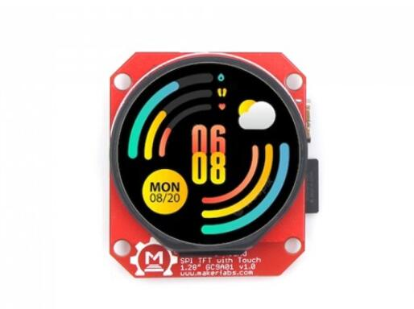
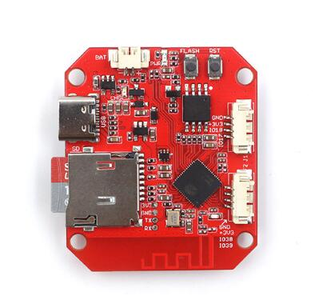
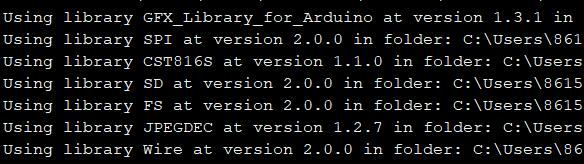

# ESP32-S3 Round SPI TFT with Touch 1.28"

```c++
/*
Version:        V1.1
Author:            Vincent
Create Date:    2023/2/18
Note:
        2023/4/15 V1.1:Add TFT_eSPI support.
*/
```

[TOC]



# Makerfabs

[Makerfabs home page](https://www.makerfabs.com/)

[Makerfabs Wiki](https://wiki.makerfabs.com/)

# ESP32-S3 Round SPI TFT with Touch 1.28"

## Intruduce

Product Link ：[ESP32-S3 Round SPI TFT with Touch 1.28"](https://www.makerfabs.com/esp32-s3-round-spi-tft-with-touch-1-28-inch.html)

Wiki Link : []()

The ESP32-S3 round display with touch can be a great tool for your applications such as smartwatch.

We selected the ESP32-S3 generation as the controller, with 16MB Flash and 8MB PSRAM, enough for most IOT applications; The round display is 240x240 resolution 1.28", colorful RGB, with capacitive touch, it communicates with ESP32 with SPI interface, so there enough GPIO left for expansion applications.

## Feature

- Controller: ESP32-S3
- Wireless: WiFi& Bluetooth 5.0
- LCD: 1.28", 240*240 resolution, driver GC9A01
- LCD interface: SPI
- Touch Panel Driver: CST816S
- USB: USB Native
- Power Supply: USB Type-C 5.0V(4.0V~5.25V); 3.7V Lipo battery
- Button: Flash button and reset button
- Mabee interface: 1*I2C; 1*GPIO
- MicroSD: Yes
- Arduino support: Yes
- Operation temperature: -40℃ to +85℃



# Code

## Complier Option

- Install board : ESP32 .
- Install libraries：



- Use type-c use cable connect USB to PC.
- Select "ESP32-S3 DEV Module"

"mf_Lvgl" library is modified from Lvgl library (version 8.3.2). 

If you want use lvgl, please unzip "lib/mf_Lvgl.zip" and copy to arduino library directory.

## Factory test program

\example\esp32s3_round_test

You can run this file test if you feel that your hardware is not working properly. 

Need copy logo_240240.jpg to sd card.


## Example

### TFT_eSPI demo

Add TFT_eSPI support.

Library version is 2.5.0

And cover "User_Setuo.h" to library directry.